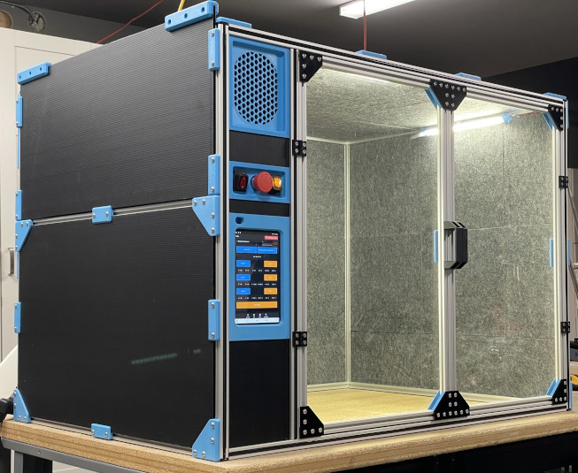
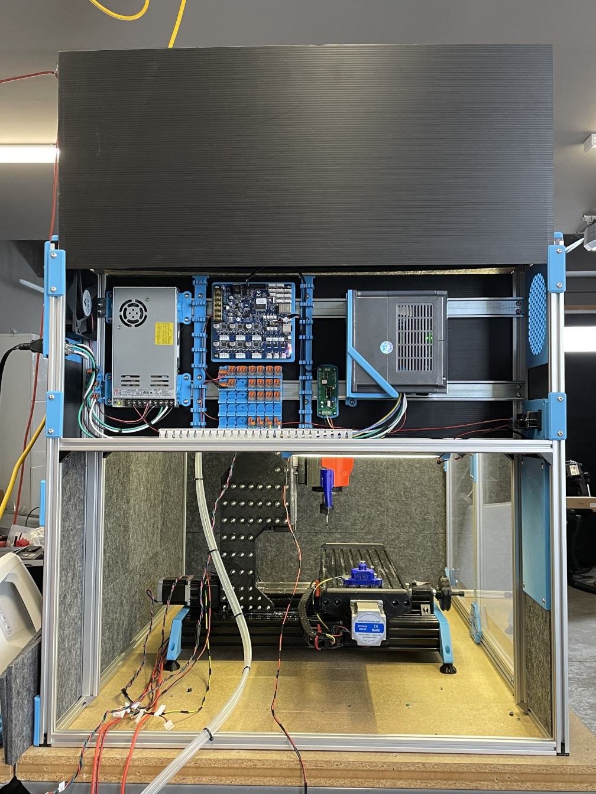

# Casa - The Millennium Machines Milo V1.5 Enclosure

**DISCLAIMER** this is a WORK IN PROGRESS, building it right now probably won't go smoothly - and some things might be wrong or even missing completely. We're actively working on it.

That being said -

Welcome to the Casa repository. This is an enclosure for our desktop milling machine, the [Millennium Machines Milo V1.5](https://github.com/MillenniumMachines/Milo-v1.5)

## Features

- Increases the safety of the operator
- Keeps the mess contained
- Reduces the sound profile of the machine
- Easily accessible electronics bay
- Illuminates the work area
- (optional) tablet mount

(and probably a lot of other cool stuff)

## Getting started

We'd recommend going through the [documentation](docs/index.md), this will help you get a grasp on the parts and work needed to build your Milo its' own little house.
